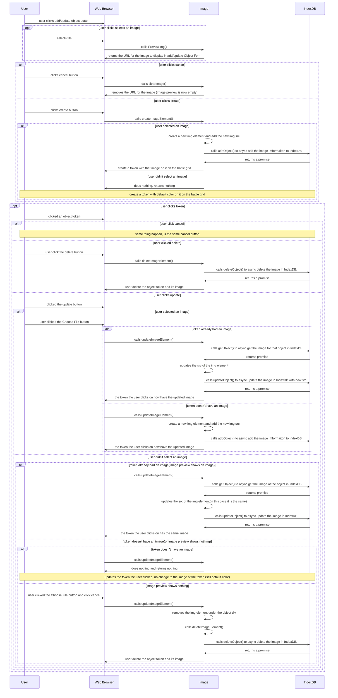

This is the Image import for object token feature. This feature lets the user chose wether they want to add image to their token. If they do they can update/delete the image on the token. Update image: can re-choose image, and will update image size with token size. If user delete the object token the image will also get deleted with it. All images are saved in IndexDB
