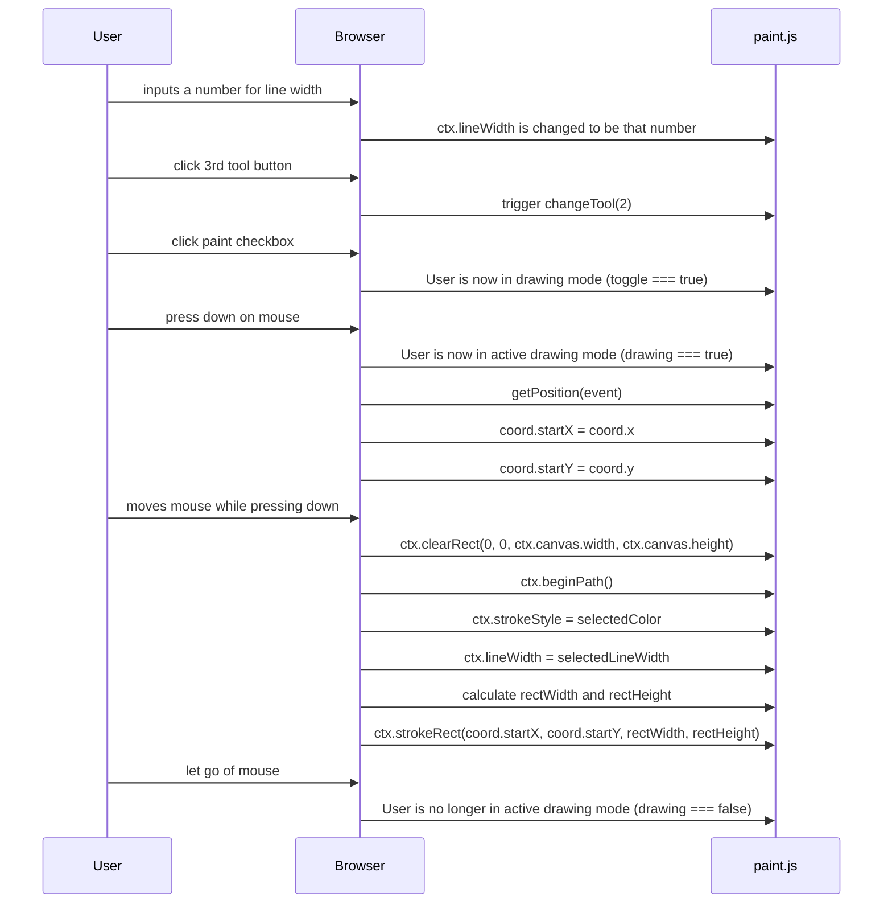

The rectangle tool allows the user to draw rectangular shapes on the canvas. The tool is activated by clicking the third button on the tool list. The user can adjust the rectangle's border width by entering a number in the line width input box and can choose a border color using the color picker. To draw a rectangle, the user presses and holds the mouse button to set the starting point, moves the mouse to adjust the rectangle's size, and releases the mouse button to finalize the shape. While drawing, the rectangle is dynamically updated, providing real-time feedback.

