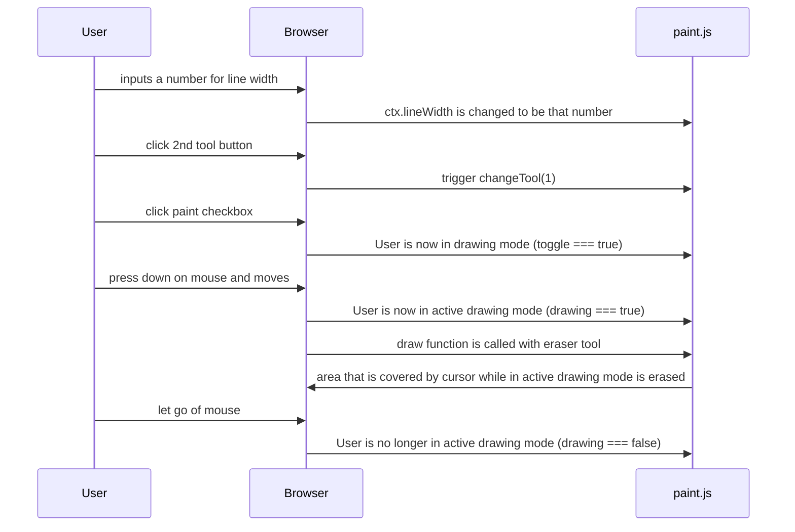

The eraser feature allows the user to erase any marks created by the other drawing tools. The eraser acts as a pen with a transparent color. Its width is adjustable by entering a number in an input box and is activated by checking the paint button and selecting the second circle on the tool list.

