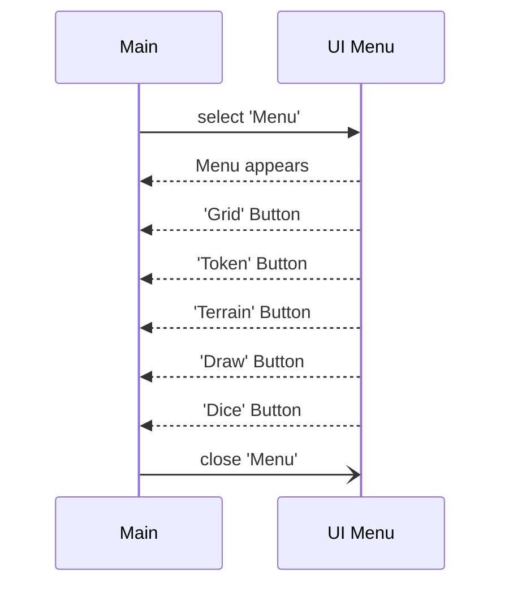

# Battle Grid Creation Feature

## Description

This is meant to represent the first iteration of the Menu UI diagram. Due to the user interface consisting of combining all the features together, the sequence diagram in of itself is lackluster. There aren't any heavy features, as most of the design work is currently going into making the user interface look visually appealing. Updates will be done on it periodically. 

<Last updated: 11/17/2023>
## Sequence Diagram

