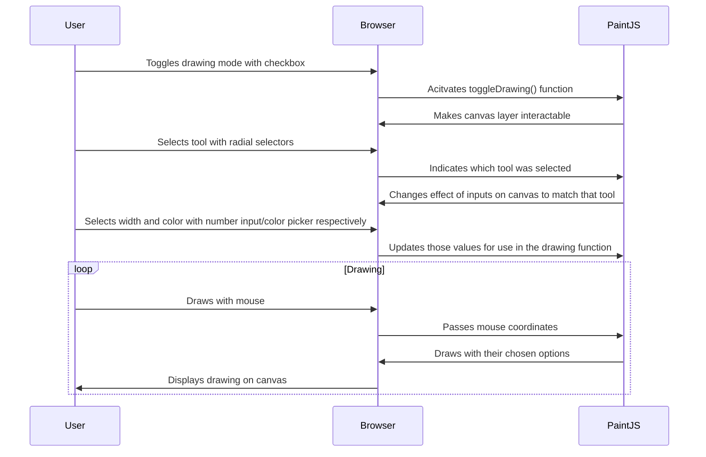

The drawing tool allows users to draw freely over the battle grid for quick notations and marking. When you enable drawing mode by entering the menu, the drawing layer becomes active and you have a variety of input options to represent different tools, colors, and size. Then, you can just draw with your mouse. And when you leave the menu, you can go back to using the grid as normal.

