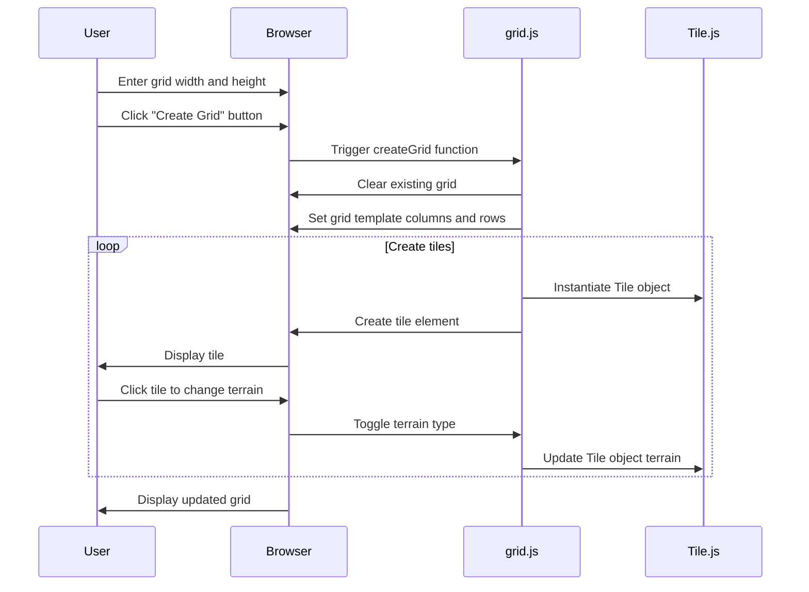

# Battle Grid Creation Feature

## Description

The battle grid creation feature allows users to specify the dimensions of a grid (width and height) and generate a customizable battle grid. Each tile in the grid can be clicked to change its terrain type and what objects can be placed on it (Putting exactly what terrain type or what objects can be placed on it was not what I specifically worked on, as that was Emily and Geri's features. I made the groundworks and the grid itself). The grid is displayed on the center of the screen, and users can interact with it to set up their battlemaps. 

## Sequence Diagram

